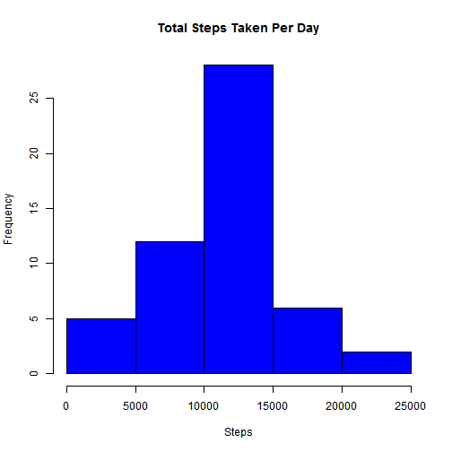
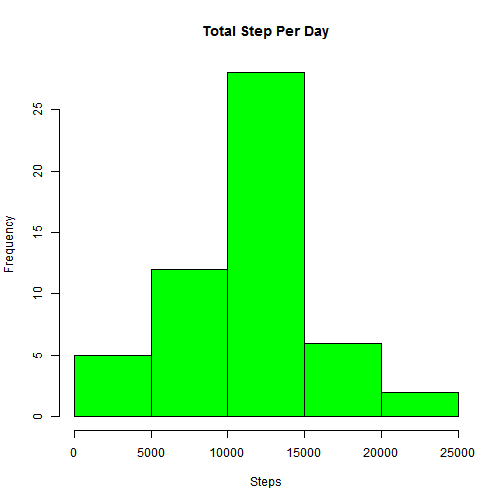
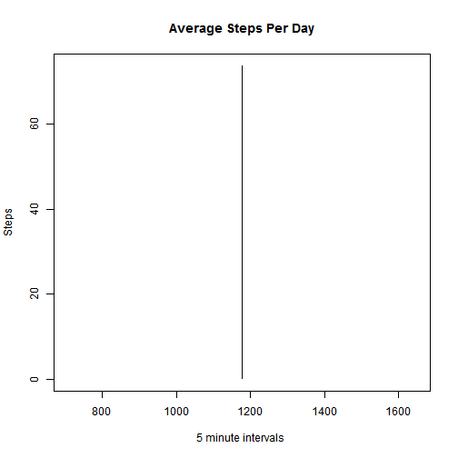
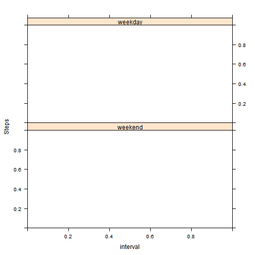
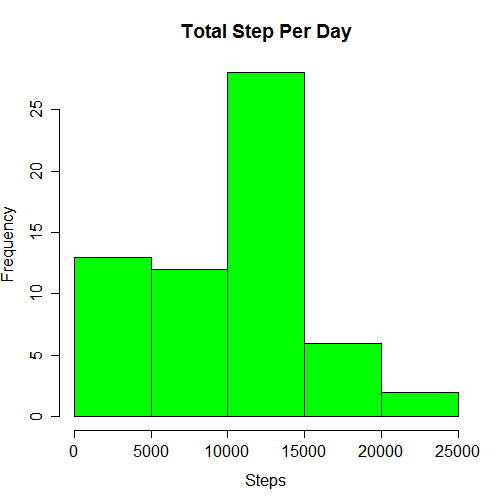

#Personal Movement Activity Monitoring Data

## Assignment 1

Set Global options so that all code chunks will specify echo = TRUE


```r
library(knitr)
opts_chunk$set(echo = TRUE)
```

The activity csv file is read into RStuido, creating a data frame name 'activity'. 
Make sure the csv file is located in your default directory. 


```r
activity <- read.csv("activity.csv", header = TRUE,sep = ",")
```

Eliminate records that contain “NA” values 


```r
activity <- na.omit(activity)
```

Sort records by date and interval


```r
activity <- activity[order(activity$date,activity$interval),]
```

Install the dplyr package to utilize the summarize feature


```r
library(dplyr)
```

Using dplyr, create a data frame  named "all_steps" that  will group by ‘date’ 
and summarize on ‘steps’ per day.


```r
all_steps <- activity %>%
    group_by(date) %>%
    summarise(total_steps = sum(steps))
all_steps
```

```
## Source: local data frame [53 x 2]
## 
##          date total_steps
##        (fctr)       (int)
## 1  2012-10-02         126
## 2  2012-10-03       11352
## 3  2012-10-04       12116
## 4  2012-10-05       13294
## 5  2012-10-06       15420
## 6  2012-10-07       11015
## 7  2012-10-09       12811
## 8  2012-10-10        9900
## 9  2012-10-11       10304
## 10 2012-10-12       17382
## ..        ...         ...
```

The tapply function can be used to give you the same results as well. 
However it will show "NA" on days that have no steps to calculate.


```r
attach(activity)
```

```
## The following objects are masked from activity (pos = 3):
## 
##     date, interval, steps
```

```r
tapply(steps,date,sum)
```

```
## 2012-10-01 2012-10-02 2012-10-03 2012-10-04 2012-10-05 2012-10-06 
##         NA        126      11352      12116      13294      15420 
## 2012-10-07 2012-10-08 2012-10-09 2012-10-10 2012-10-11 2012-10-12 
##      11015         NA      12811       9900      10304      17382 
## 2012-10-13 2012-10-14 2012-10-15 2012-10-16 2012-10-17 2012-10-18 
##      12426      15098      10139      15084      13452      10056 
## 2012-10-19 2012-10-20 2012-10-21 2012-10-22 2012-10-23 2012-10-24 
##      11829      10395       8821      13460       8918       8355 
## 2012-10-25 2012-10-26 2012-10-27 2012-10-28 2012-10-29 2012-10-30 
##       2492       6778      10119      11458       5018       9819 
## 2012-10-31 2012-11-01 2012-11-02 2012-11-03 2012-11-04 2012-11-05 
##      15414         NA      10600      10571         NA      10439 
## 2012-11-06 2012-11-07 2012-11-08 2012-11-09 2012-11-10 2012-11-11 
##       8334      12883       3219         NA         NA      12608 
## 2012-11-12 2012-11-13 2012-11-14 2012-11-15 2012-11-16 2012-11-17 
##      10765       7336         NA         41       5441      14339 
## 2012-11-18 2012-11-19 2012-11-20 2012-11-21 2012-11-22 2012-11-23 
##      15110       8841       4472      12787      20427      21194 
## 2012-11-24 2012-11-25 2012-11-26 2012-11-27 2012-11-28 2012-11-29 
##      14478      11834      11162      13646      10183       7047 
## 2012-11-30 
##         NA
```

The aggergate is another option

```r
aggregate(steps ~ date,activity,sum)
```

```
##          date steps
## 1  2012-10-02   126
## 2  2012-10-03 11352
## 3  2012-10-04 12116
## 4  2012-10-05 13294
## 5  2012-10-06 15420
## 6  2012-10-07 11015
## 7  2012-10-09 12811
## 8  2012-10-10  9900
## 9  2012-10-11 10304
## 10 2012-10-12 17382
## 11 2012-10-13 12426
## 12 2012-10-14 15098
## 13 2012-10-15 10139
## 14 2012-10-16 15084
## 15 2012-10-17 13452
## 16 2012-10-18 10056
## 17 2012-10-19 11829
## 18 2012-10-20 10395
## 19 2012-10-21  8821
## 20 2012-10-22 13460
## 21 2012-10-23  8918
## 22 2012-10-24  8355
## 23 2012-10-25  2492
## 24 2012-10-26  6778
## 25 2012-10-27 10119
## 26 2012-10-28 11458
## 27 2012-10-29  5018
## 28 2012-10-30  9819
## 29 2012-10-31 15414
## 30 2012-11-02 10600
## 31 2012-11-03 10571
## 32 2012-11-05 10439
## 33 2012-11-06  8334
## 34 2012-11-07 12883
## 35 2012-11-08  3219
## 36 2012-11-11 12608
## 37 2012-11-12 10765
## 38 2012-11-13  7336
## 39 2012-11-15    41
## 40 2012-11-16  5441
## 41 2012-11-17 14339
## 42 2012-11-18 15110
## 43 2012-11-19  8841
## 44 2012-11-20  4472
## 45 2012-11-21 12787
## 46 2012-11-22 20427
## 47 2012-11-23 21194
## 48 2012-11-24 14478
## 49 2012-11-25 11834
## 50 2012-11-26 11162
## 51 2012-11-27 13646
## 52 2012-11-28 10183
## 53 2012-11-29  7047
```

########################################

Histogram of the total number of steps taken each day


```r
with(all_steps, hist(all_steps$total_steps,main = "Total Steps Taken Per Day",
                     xlab ="Steps", col = "blue" ))
```

 

```r
dev.copy(png,file ="steps1.png")
```

```
## png 
##   5
```

```r
dev.off()
```

```
## RStudioGD 
##         2
```

Histogram can also be created using the tapply function


```r
with(activity, hist(tapply(steps,date,sum),main = "Total Step Per Day",xlab = "Steps", col = "green"))
```

 

```r
dev.copy(png,file ="steps2.png")
```

```
## png 
##   5
```

```r
dev.off()
```

```
## RStudioGD 
##         2
```

calculate the mean and median of the total number of steps per day


```r
daily_steps_mean <- activity %>%
    group_by(date) %>%
    summarise(average_steps = mean(steps))
daily_steps_mean
```

```
## Source: local data frame [53 x 2]
## 
##          date average_steps
##        (fctr)         (dbl)
## 1  2012-10-02       0.43750
## 2  2012-10-03      39.41667
## 3  2012-10-04      42.06944
## 4  2012-10-05      46.15972
## 5  2012-10-06      53.54167
## 6  2012-10-07      38.24653
## 7  2012-10-09      44.48264
## 8  2012-10-10      34.37500
## 9  2012-10-11      35.77778
## 10 2012-10-12      60.35417
## ..        ...           ...
```

Or you can use the aggregate function


```r
aggregate(steps ~ date,activity,mean)
```

```
##          date      steps
## 1  2012-10-02  0.4375000
## 2  2012-10-03 39.4166667
## 3  2012-10-04 42.0694444
## 4  2012-10-05 46.1597222
## 5  2012-10-06 53.5416667
## 6  2012-10-07 38.2465278
## 7  2012-10-09 44.4826389
## 8  2012-10-10 34.3750000
## 9  2012-10-11 35.7777778
## 10 2012-10-12 60.3541667
## 11 2012-10-13 43.1458333
## 12 2012-10-14 52.4236111
## 13 2012-10-15 35.2048611
## 14 2012-10-16 52.3750000
## 15 2012-10-17 46.7083333
## 16 2012-10-18 34.9166667
## 17 2012-10-19 41.0729167
## 18 2012-10-20 36.0937500
## 19 2012-10-21 30.6284722
## 20 2012-10-22 46.7361111
## 21 2012-10-23 30.9652778
## 22 2012-10-24 29.0104167
## 23 2012-10-25  8.6527778
## 24 2012-10-26 23.5347222
## 25 2012-10-27 35.1354167
## 26 2012-10-28 39.7847222
## 27 2012-10-29 17.4236111
## 28 2012-10-30 34.0937500
## 29 2012-10-31 53.5208333
## 30 2012-11-02 36.8055556
## 31 2012-11-03 36.7048611
## 32 2012-11-05 36.2465278
## 33 2012-11-06 28.9375000
## 34 2012-11-07 44.7326389
## 35 2012-11-08 11.1770833
## 36 2012-11-11 43.7777778
## 37 2012-11-12 37.3784722
## 38 2012-11-13 25.4722222
## 39 2012-11-15  0.1423611
## 40 2012-11-16 18.8923611
## 41 2012-11-17 49.7881944
## 42 2012-11-18 52.4652778
## 43 2012-11-19 30.6979167
## 44 2012-11-20 15.5277778
## 45 2012-11-21 44.3993056
## 46 2012-11-22 70.9270833
## 47 2012-11-23 73.5902778
## 48 2012-11-24 50.2708333
## 49 2012-11-25 41.0902778
## 50 2012-11-26 38.7569444
## 51 2012-11-27 47.3819444
## 52 2012-11-28 35.3576389
## 53 2012-11-29 24.4687500
```
For the median:


```r
daily_steps_median <- activity %>%
    group_by(date) %>%
    summarise(average_steps = median(steps))
daily_steps_median
```

```
## Source: local data frame [53 x 2]
## 
##          date average_steps
##        (fctr)         (dbl)
## 1  2012-10-02             0
## 2  2012-10-03             0
## 3  2012-10-04             0
## 4  2012-10-05             0
## 5  2012-10-06             0
## 6  2012-10-07             0
## 7  2012-10-09             0
## 8  2012-10-10             0
## 9  2012-10-11             0
## 10 2012-10-12             0
## ..        ...           ...
```
The aggregate fuction can be used as well


```r
aggregate(steps ~ date,activity,median)
```

```
##          date steps
## 1  2012-10-02     0
## 2  2012-10-03     0
## 3  2012-10-04     0
## 4  2012-10-05     0
## 5  2012-10-06     0
## 6  2012-10-07     0
## 7  2012-10-09     0
## 8  2012-10-10     0
## 9  2012-10-11     0
## 10 2012-10-12     0
## 11 2012-10-13     0
## 12 2012-10-14     0
## 13 2012-10-15     0
## 14 2012-10-16     0
## 15 2012-10-17     0
## 16 2012-10-18     0
## 17 2012-10-19     0
## 18 2012-10-20     0
## 19 2012-10-21     0
## 20 2012-10-22     0
## 21 2012-10-23     0
## 22 2012-10-24     0
## 23 2012-10-25     0
## 24 2012-10-26     0
## 25 2012-10-27     0
## 26 2012-10-28     0
## 27 2012-10-29     0
## 28 2012-10-30     0
## 29 2012-10-31     0
## 30 2012-11-02     0
## 31 2012-11-03     0
## 32 2012-11-05     0
## 33 2012-11-06     0
## 34 2012-11-07     0
## 35 2012-11-08     0
## 36 2012-11-11     0
## 37 2012-11-12     0
## 38 2012-11-13     0
## 39 2012-11-15     0
## 40 2012-11-16     0
## 41 2012-11-17     0
## 42 2012-11-18     0
## 43 2012-11-19     0
## 44 2012-11-20     0
## 45 2012-11-21     0
## 46 2012-11-22     0
## 47 2012-11-23     0
## 48 2012-11-24     0
## 49 2012-11-25     0
## 50 2012-11-26     0
## 51 2012-11-27     0
## 52 2012-11-28     0
## 53 2012-11-29     0
```


Plot average daily activity pattern
#####################################
I plotted the average intervals and the average steps.  I know it is not correct but 
if time allows, I will come back and correct it. 


```r
plot_interval<- aggregate(interval ~ date,activity,mean)

plot(plot_interval[,2],daily_steps_mean$average_steps,
     main ="Average Steps Per Day",xlab = "5 minute intervals ", ylab = "Steps", type='l' )
```

 

```r
dev.copy(png,file ="interval1.png")
```

```
## png 
##   5
```

```r
dev.off()
```

```
## RStudioGD 
##         2
```

#####################################
Which 5 minute  interval, on average across all days in the dataset, 
contains the maximum nmber of steps?

steps       date    interval
713     2012-10-22     1155

The average 5 minute interval is 1177.5
The average seems to be the same if I averaged by group or over-all 5-minute interval.

This is by group

```r
plot_interval<- aggregate(interval ~ date,activity,mean)
```

This is for over-all average

```r
chck_interval <- activity[,3]
mean(chck_interval)
```

```
## [1] 1177.5
```

Next, I checked for the interval that is closest to 1177.5, mean value.
then ordered the returned set, and then processed the 'tail' value 

```r
maxsteps <- subset(activity, as.integer(activity[,3]) <= 1178)
maxsteps <- maxsteps[order(maxsteps$interval),]
tail(maxsteps,6)
```

```
##       steps       date interval
## 15696     0 2012-11-24     1155
## 15984   371 2012-11-25     1155
## 16272   199 2012-11-26     1155
## 16560    70 2012-11-27     1155
## 16848     0 2012-11-28     1155
## 17136     0 2012-11-29     1155
```

Now that I know 1155 is the closest value to the mean.
I create a subset dataset of all 5-minute intervals of 1155.
Ordered the set by steps, and then 'tailed' the last 6 records,get the last value. 

```r
max_set <- subset(maxsteps, maxsteps[,3] == 1155)
max_set <- max_set[order(max_set$steps),]
tail(max_set,6)
```

```
##       steps       date interval
## 6480    156 2012-10-23     1155
## 11952   170 2012-11-11     1155
## 16272   199 2012-11-26     1155
## 15984   371 2012-11-25     1155
## 13392   431 2012-11-16     1155
## 6192    713 2012-10-22     1155
```
 steps       date   interval
713     2012-10-22     1155

################################################
Imputing missing values

To remove bias from the previous steps, I removed the “NA” value.  
So for this step, I will re-read the activity set and give it another name activity2. 
Then, order by date and interval.


```r
activity2 <- read.csv("activity.csv", header = TRUE,sep = ",")

activity2 <- activity2[order(activity2$date,activity2$interval),]
```

Calculate and report total number of rows with NA

```r
all_missing <- activity2[!complete.cases(activity2),]
nrow(all_missing)
```

```
## [1] 2304
```
################################################
Devise a strategy for filling in all the missing values in the dataset.


```r
activity2$steps[which(is.na(activity2$steps))] <- mean(activity2$interval)
tail(activity2,6)
```

```
##        steps       date interval
## 17563 1177.5 2012-11-30     2330
## 17564 1177.5 2012-11-30     2335
## 17565 1177.5 2012-11-30     2340
## 17566 1177.5 2012-11-30     2345
## 17567 1177.5 2012-11-30     2350
## 17568 1177.5 2012-11-30     2355
```
The missing values were replaced with the mean interval value.

###############################################

Create a new dataset that is equal to the original dataset 
but with the missing data filled in.

I re-loaded the data file to get the original, then substituted the "NA" 
with 0.

```r
activity <- read.csv("activity.csv", header = TRUE,sep = ",")

new_activity <- evalq(activity, activity$steps[which(is.na(activity$steps))] <- 0)
head(new_activity,6)
```

```
##   steps       date interval
## 1     0 2012-10-01        0
## 2     0 2012-10-01        5
## 3     0 2012-10-01       10
## 4     0 2012-10-01       15
## 5     0 2012-10-01       20
## 6     0 2012-10-01       25
```
The "NA" were replaced with zeros.
#################################################

Histogram of total number of steps taken each day


```r
daily_steps <- new_activity %>%
    group_by(date) %>%
    summarise(total_steps = sum(steps))
daily_steps
```

```
## Source: local data frame [61 x 2]
## 
##          date total_steps
##        (fctr)       (dbl)
## 1  2012-10-01           0
## 2  2012-10-02         126
## 3  2012-10-03       11352
## 4  2012-10-04       12116
## 5  2012-10-05       13294
## 6  2012-10-06       15420
## 7  2012-10-07       11015
## 8  2012-10-08           0
## 9  2012-10-09       12811
## 10 2012-10-10        9900
## ..        ...         ...
```

```r
with(daily_steps, hist(daily_steps$total_steps,main = "Total Steps Taken Per Day",
                     xlab ="Steps", col = "blue" ))
```

 

```r
dev.copy(png,file ="tsteps1.png")
```

```
## png 
##   5
```

```r
dev.off()
```

```
## RStudioGD 
##         2
```

```r
with(new_activity, hist(tapply(steps,date,sum),main = "Total Step Per Day",xlab = "Steps", col = "green"))
```

  

```r
dev.copy(png,file ="tsteps2.png")
```

```
## png 
##   5
```

```r
dev.off()
```

```
## RStudioGD 
##         2
```

Calculate and report the mean and median total number of steps per day


```r
mean_steps <- new_activity %>%
    group_by(date) %>%
    summarise(average_steps = mean(steps))
mean_steps
```

```
## Source: local data frame [61 x 2]
## 
##          date average_steps
##        (fctr)         (dbl)
## 1  2012-10-01       0.00000
## 2  2012-10-02       0.43750
## 3  2012-10-03      39.41667
## 4  2012-10-04      42.06944
## 5  2012-10-05      46.15972
## 6  2012-10-06      53.54167
## 7  2012-10-07      38.24653
## 8  2012-10-08       0.00000
## 9  2012-10-09      44.48264
## 10 2012-10-10      34.37500
## ..        ...           ...
```

You can also use the aggregate functon


```r
aggregate(steps ~ date,new_activity,mean)
```

```
##          date      steps
## 1  2012-10-01  0.0000000
## 2  2012-10-02  0.4375000
## 3  2012-10-03 39.4166667
## 4  2012-10-04 42.0694444
## 5  2012-10-05 46.1597222
## 6  2012-10-06 53.5416667
## 7  2012-10-07 38.2465278
## 8  2012-10-08  0.0000000
## 9  2012-10-09 44.4826389
## 10 2012-10-10 34.3750000
## 11 2012-10-11 35.7777778
## 12 2012-10-12 60.3541667
## 13 2012-10-13 43.1458333
## 14 2012-10-14 52.4236111
## 15 2012-10-15 35.2048611
## 16 2012-10-16 52.3750000
## 17 2012-10-17 46.7083333
## 18 2012-10-18 34.9166667
## 19 2012-10-19 41.0729167
## 20 2012-10-20 36.0937500
## 21 2012-10-21 30.6284722
## 22 2012-10-22 46.7361111
## 23 2012-10-23 30.9652778
## 24 2012-10-24 29.0104167
## 25 2012-10-25  8.6527778
## 26 2012-10-26 23.5347222
## 27 2012-10-27 35.1354167
## 28 2012-10-28 39.7847222
## 29 2012-10-29 17.4236111
## 30 2012-10-30 34.0937500
## 31 2012-10-31 53.5208333
## 32 2012-11-01  0.0000000
## 33 2012-11-02 36.8055556
## 34 2012-11-03 36.7048611
## 35 2012-11-04  0.0000000
## 36 2012-11-05 36.2465278
## 37 2012-11-06 28.9375000
## 38 2012-11-07 44.7326389
## 39 2012-11-08 11.1770833
## 40 2012-11-09  0.0000000
## 41 2012-11-10  0.0000000
## 42 2012-11-11 43.7777778
## 43 2012-11-12 37.3784722
## 44 2012-11-13 25.4722222
## 45 2012-11-14  0.0000000
## 46 2012-11-15  0.1423611
## 47 2012-11-16 18.8923611
## 48 2012-11-17 49.7881944
## 49 2012-11-18 52.4652778
## 50 2012-11-19 30.6979167
## 51 2012-11-20 15.5277778
## 52 2012-11-21 44.3993056
## 53 2012-11-22 70.9270833
## 54 2012-11-23 73.5902778
## 55 2012-11-24 50.2708333
## 56 2012-11-25 41.0902778
## 57 2012-11-26 38.7569444
## 58 2012-11-27 47.3819444
## 59 2012-11-28 35.3576389
## 60 2012-11-29 24.4687500
## 61 2012-11-30  0.0000000
```
for median

```r
median_steps <- new_activity %>%
    group_by(date) %>%
    summarise(average_steps = median(steps))
median_steps
```

```
## Source: local data frame [61 x 2]
## 
##          date average_steps
##        (fctr)         (dbl)
## 1  2012-10-01             0
## 2  2012-10-02             0
## 3  2012-10-03             0
## 4  2012-10-04             0
## 5  2012-10-05             0
## 6  2012-10-06             0
## 7  2012-10-07             0
## 8  2012-10-08             0
## 9  2012-10-09             0
## 10 2012-10-10             0
## ..        ...           ...
```

You can also use the aggregate functon

```r
aggregate(steps ~ date,new_activity,median)
```

```
##          date steps
## 1  2012-10-01     0
## 2  2012-10-02     0
## 3  2012-10-03     0
## 4  2012-10-04     0
## 5  2012-10-05     0
## 6  2012-10-06     0
## 7  2012-10-07     0
## 8  2012-10-08     0
## 9  2012-10-09     0
## 10 2012-10-10     0
## 11 2012-10-11     0
## 12 2012-10-12     0
## 13 2012-10-13     0
## 14 2012-10-14     0
## 15 2012-10-15     0
## 16 2012-10-16     0
## 17 2012-10-17     0
## 18 2012-10-18     0
## 19 2012-10-19     0
## 20 2012-10-20     0
## 21 2012-10-21     0
## 22 2012-10-22     0
## 23 2012-10-23     0
## 24 2012-10-24     0
## 25 2012-10-25     0
## 26 2012-10-26     0
## 27 2012-10-27     0
## 28 2012-10-28     0
## 29 2012-10-29     0
## 30 2012-10-30     0
## 31 2012-10-31     0
## 32 2012-11-01     0
## 33 2012-11-02     0
## 34 2012-11-03     0
## 35 2012-11-04     0
## 36 2012-11-05     0
## 37 2012-11-06     0
## 38 2012-11-07     0
## 39 2012-11-08     0
## 40 2012-11-09     0
## 41 2012-11-10     0
## 42 2012-11-11     0
## 43 2012-11-12     0
## 44 2012-11-13     0
## 45 2012-11-14     0
## 46 2012-11-15     0
## 47 2012-11-16     0
## 48 2012-11-17     0
## 49 2012-11-18     0
## 50 2012-11-19     0
## 51 2012-11-20     0
## 52 2012-11-21     0
## 53 2012-11-22     0
## 54 2012-11-23     0
## 55 2012-11-24     0
## 56 2012-11-25     0
## 57 2012-11-26     0
## 58 2012-11-27     0
## 59 2012-11-28     0
## 60 2012-11-29     0
## 61 2012-11-30     0
```

Do these values differ from the estimates from the first part of the assignment?  It differs only because the missing data is filled in.  So, more zeros are added.  Now more days are included in the total calculations.   The first part of the assignment indicated a normal distribution of data because the mean and the median are the same.  

What is the impact of imputing missing data on the estimates of the total daily number of steps?
The value for each day does not change.  However new values are added for the missing days.  So the missing days are now included in the calculations. This causes the histogram to be more skewed.  The x-axis on the histogram is not symmetric, which results in a not so normal distribution.

#############################################
Patterns between weekdays and weekends

Create a new factor vaiable in the dataset with two levels, "weekday" and "weekend"

-    Installed the “lubridate” package  so I could use the wday option. 
-	 Created a variable, ‘mydate’, that contained the date column from the new_activity dataset.
-	 Created a new dataset, ’factor_set’, using new_activity and adding the column ‘mydate’ 
    using the cbind function and  wday from the lubridate package. 
-	Changed the column name for column 4.
-	Changed the class of column 4 to be a factor class. 
-	Change the levels in the factor from 1,2,3,4,5,6,7 to “weekday” and “weekend” 
-	Made factor_set the new new_activity dataset. 


```r
library(lubridate)

mydate <- as.Date(new_activity[,2])

factor_set <- cbind(new_activity,wday(mydate))

colnames(factor_set) <- c("steps","date","interval","day")

factor_set[,4] <- factor(factor_set[,4], labels = c("weekend", "weekday","weekday",
                                                    "weekday","weekday","weekday","weekend"))
```

```
## Warning in `levels<-`(`*tmp*`, value = if (nl == nL) as.character(labels)
## else paste0(labels, : duplicated levels in factors are deprecated
```

```r
new_activity <- factor_set
head(new_activity,6)
```

```
##   steps       date interval     day
## 1     0 2012-10-01        0 weekday
## 2     0 2012-10-01        5 weekday
## 3     0 2012-10-01       10 weekday
## 4     0 2012-10-01       15 weekday
## 5     0 2012-10-01       20 weekday
## 6     0 2012-10-01       25 weekday
```

Make a pannel plot containing a time series plot of the intervals and average numberof steps
taken,average across all weekdays or weekends.

library(lattice)

x <- tapply(new_activity$interval,new_activity$date,mean)
y <- plot_interval$average_steps[new_activity$day 
f <- new_activity[,4]

xyplot(y ~ x | f, type ="l", layout = c(1,2), ylab = "Steps", xlab ="interval")


